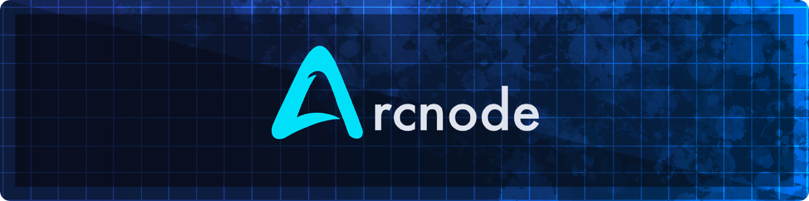
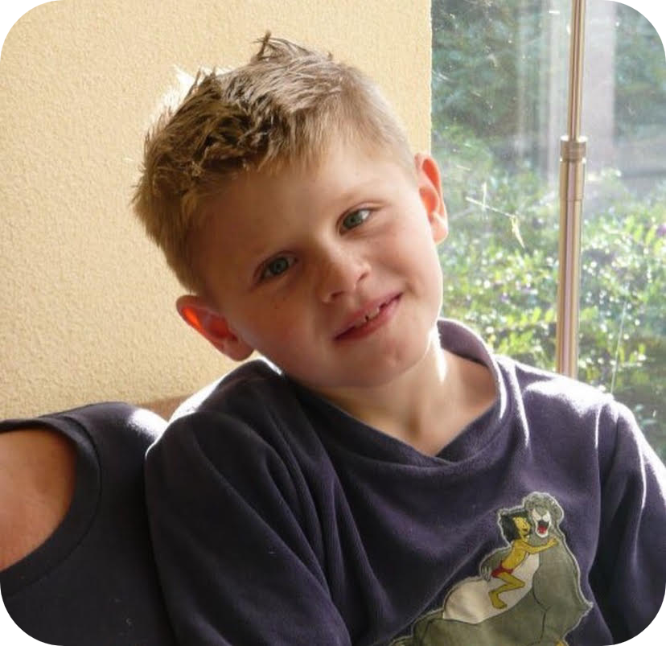
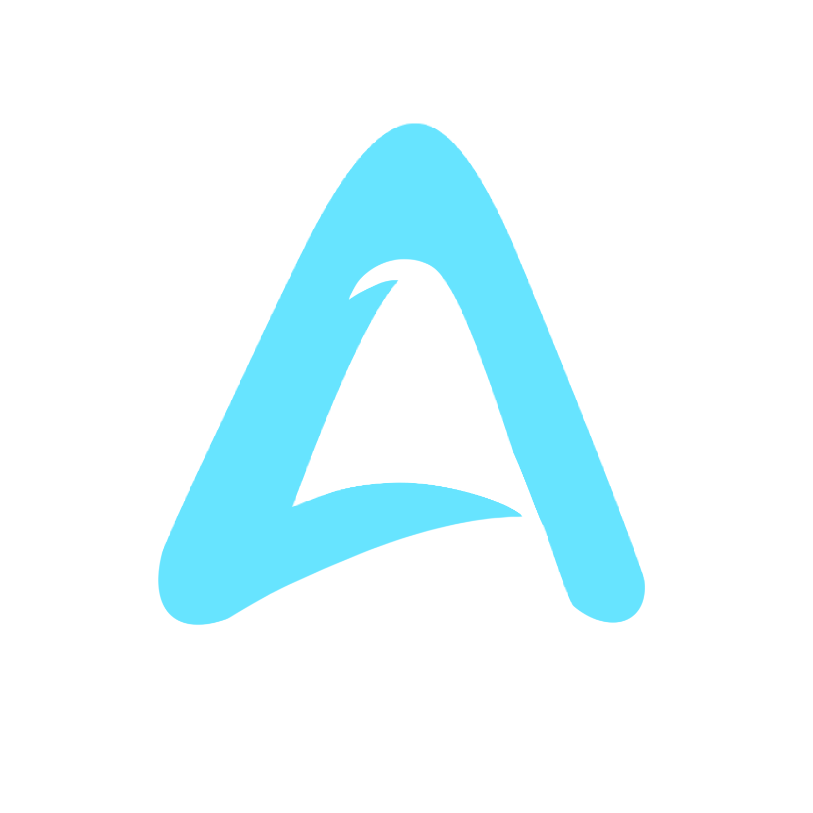

  

  

&nbsp;

&nbsp;

&nbsp;

---

 

<table>
<tr>
<td width="220" valign="top" align="center">

  

**`stinoooo`** &nbsp;·&nbsp; he/him

 

 

 

 

</td>
<td valign="top">

## &nbsp;Who Am I?

I'm **Stijn**, a **23-year-old**<!-- DYNAMIC_AGE: born 2002-10-09 --> Computer Science and Software Engineering student from the **Netherlands**.

When I have an idea, I don't just think about it. I start naming it, structuring it, building a folder for it, and wondering if it needs its own subdomain. (It probably does.) There's a builder instinct that kicks in before the rational part of my brain gets a say. I think in systems and ecosystems, which is exactly how [**Arcnode**](https://arcnode.dev) came to exist.

I care about clean architecture, well-defined structure, and code that still makes sense six months later. I work across multiple stacks — PHP, TypeScript, Next.js, Python, Node.js — and I take real pride in building things that feel **complete**, not just functional. *"It works"* is not the finish line. There is always a refinement pass.

Outside of what I ship, I spend a lot of time learning about **AI**: how it works, how it's changing the way software gets built, and how to use it properly rather than just as a shortcut. It's the most interesting shift happening in tech right now, and I want to understand it deeply.

Programming is my degree. It's also my weekend. That overlap is not a coincidence.

 

| | |
|---|---|
| 🧱 | **Fluent across stacks** — LAMP · MERN · Next.js/Prisma/PostgreSQL · Electron, and more |
| 🧠 | **Strong OOP mindset** — clean interfaces, maintainable systems, things that scale |
| 🚀 | **Currently deep-diving** — Next.js 15 · AI tooling · production-grade deployments |
| 📬 | **Always open for a chat** — [stijn@stinoo.dev](mailto:stijn@stinoo.dev) |

</td>
</tr>
</table>

 

---

 

<h2>Arcnode</h2>

**Platform Studio · [arcnode.dev](https://arcnode.dev)**

> Arcnode is not a single product. It is a **platform studio**: a structured workspace and launchpad for focused, well-engineered software. Each project is built with intention, designed for quality, and ships under one unified umbrella. Everything fits together by design.

| Project | Status | Stack | Description |
|---|---|---|---|
| [**ArcTasks**](https://arcnode.dev#projects) |  | Next.js · Prisma · PostgreSQL | Full-featured task management app |
| [**ArcType**](https://arcnode.dev#projects) |  | Next.js · TypeScript · NextAuth | Feature-rich typing test platform |
| [**ArcUnzip**](https://unzip.arcnode.dev) |  | Next.js · TypeScript | Fast, clean online file unzipper |
| [**ArcJournal**](https://github.com/stinoooo/ArcJournal) |  | Electron · Desktop | Cross-platform desktop journaling app |
| [**Stinoo Bot**](https://bot.stinoo.dev) |  | discord.js · MongoDB | Multipurpose Discord bot |
| [**Kapsalon**](https://kapsalon.stinoo.dev) |  | PHP · MySQL | Full-stack hairdresser booking system |
| [**Stack**](https://stack.stinoo.dev) |  | Web · Frontend | Browser-based block-stacking arcade game |
| [**Yummy**](https://yummy.stinoo.dev) |  | Web · Branding | Modern snackbar concept website |

 

---

 

## &nbsp;Tech Stack

**Languages**

**Frameworks & Libraries**

**Databases & ORM**

**DevOps & Infrastructure**

**APIs & Protocols**

**Design & Tooling**

**Currently Exploring**

 

---

 

## &nbsp;GitHub Stats

&nbsp;&nbsp;

 

---

 

## &nbsp;Get In Touch

Open to collaboration, freelance projects, or just a good conversation about software.

 

&nbsp;

 

&nbsp;

&nbsp;

&nbsp;

&nbsp;

 

---

Part of the <a href="https://stinoo.dev">stinoo.dev</a> network &nbsp;·&nbsp; <a href="https://arcnode.dev">arcnode.dev</a> &nbsp;·&nbsp; Built with intention

